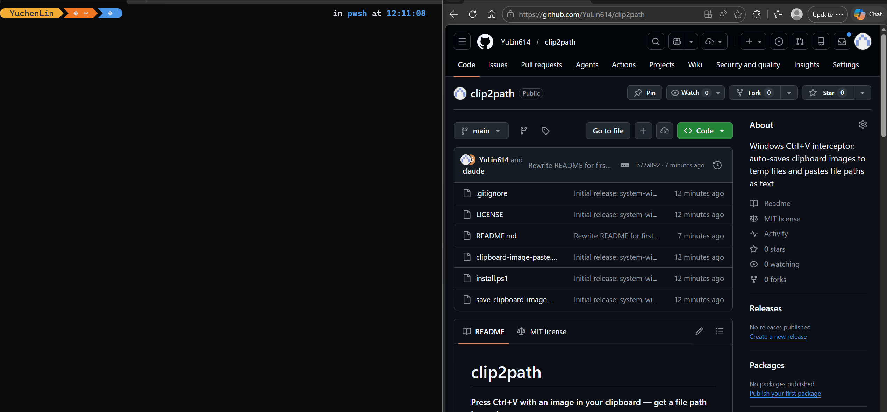

# clip2path

**Press Ctrl+V with an image in your clipboard — get a file path instead.**



Useful when working with AI tools like Claude Code, Cursor, or any terminal app that needs a file path to an image rather than the image itself.

- Screenshot with Win+Shift+S → Ctrl+V → `C:\Users\...\cc-img-20260603.png`
- Copy image from browser → Ctrl+V → file path as text
- Copy text → Ctrl+V → works exactly as normal, zero change
- Paste image in Slack, Discord, Teams, or a browser → image pastes normally

---

## Install

**Step 1 — Clone the repo**

```powershell
git clone https://github.com/YuLin614/clip2path.git
cd clip2path
```

**Step 2 — Run the installer (one command, admin not required)**

```powershell
powershell -ExecutionPolicy Bypass -File install.ps1
```

That is it. The installer will:
- Install AutoHotkey v2 automatically via winget (if not already on your machine)
- Register the script to run every time you log in
- Start it immediately — no restart needed

You should see an AutoHotkey icon appear in your system tray. From that point on, Ctrl+V is intercepted when the clipboard has an image.

---

## How to use

1. Take a screenshot with **Win+Shift+S** (or copy any image from anywhere)
2. Go to wherever you want to reference the image (terminal, chat input, code editor)
3. Press **Ctrl+V**
4. A file path like `C:\Users\YourName\AppData\Local\Temp\cc-img-20260603123456.png` is typed in

The image file is saved in your system temp folder. You can read it, attach it, or pass it to any tool that accepts a file path.

Regular text paste is completely unaffected.

---

## Uninstall

```powershell
# Stop the running script
Get-Process AutoHotkey -ErrorAction SilentlyContinue | Stop-Process -Force

# Remove the startup entry
Remove-Item "$env:APPDATA\Microsoft\Windows\Start Menu\Programs\Startup\clipboard-image-paste.lnk" -ErrorAction SilentlyContinue
```

Then delete the `clip2path` folder.

---

## Requirements

- Windows 10 or 11
- PowerShell 5.1 (built-in on all modern Windows)
- winget (built-in on Windows 11; [get it for Windows 10](https://aka.ms/getwinget))
- AutoHotkey v2 — installed automatically by the installer

---

## Known limitations

- ~300–500ms delay when clipboard has an image (only then, not for text paste)
- The AHK tray icon must be running for the hotkey to work
- Temp image files (`%TEMP%\cc-img-*.png`) are not auto-deleted — clean them up manually if disk space matters

---

## How it works (technical)

AutoHotkey v2 intercepts Ctrl+V system-wide. It calls the Win32 API `IsClipboardFormatAvailable` to check for image formats instantly without spawning a process. If an image is detected, it checks the active window's process name — apps that natively support image paste (Slack, Discord, Teams, WhatsApp, Chrome, Edge, Firefox, and other browsers) are skipped so the image pastes normally. For all other apps, a PowerShell helper (`save-clipboard-image.ps1`) saves the image as a PNG using `System.Windows.Forms.Clipboard` and returns the path. AHK then types that path using `SendText`. If no image, Ctrl+V passes through unchanged.

---

## License

MIT
